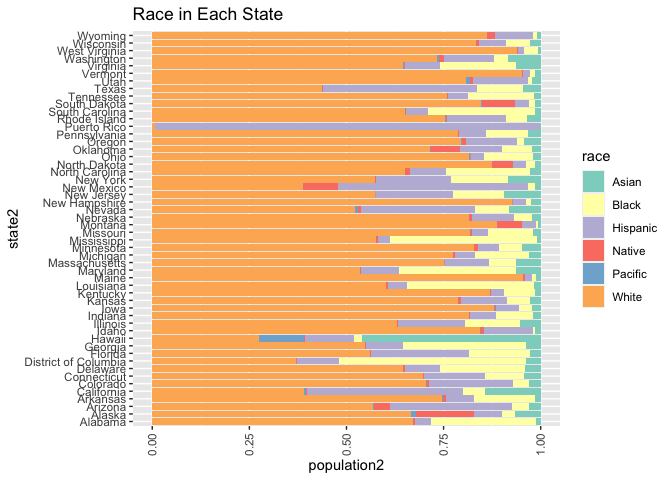
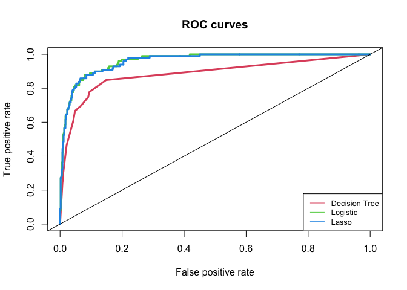

2020 Election Analysis
================
Yuchen Zheng, Kelly Wang
12/6/2020

``` r
## loading packages
library(tidyverse)
library(ggplot2)
library(maps)
library(tree) 
library(maptree) 
library(randomForest) 
library(gbm) 
library(ROCR)
library(glmnet)
library(FNN)
```

## Data

``` r
## read data and convert candidate names and party names from string to factor
election.raw <- read_csv("./2020_election_data/candidates_county.csv", col_names = TRUE) %>% 
  mutate(candidate = as.factor(candidate), party = as.factor(party))

## remove the word "County" from the county names
words.to.remove = c("County")
remove.words <- function(str, words.to.remove){
  sapply(str, function(str){
    x <- unlist(strsplit(str, " "))
    x <- x[!x %in% words.to.remove]
    return(paste(x, collapse = " "))
  }, simplify = "array", USE.NAMES = FALSE)
}
election.raw$county <- remove.words(election.raw$county, words.to.remove)

## read census data
census <- read_csv("./2020_election_data/census_county.csv") 
```

## Election data

1.  
<!-- end list -->

``` r
## dimension
print(dim(election.raw))
```

    ## [1] 31167     5

``` r
## missing value
print(as.vector(is.na(election.raw)) %>% unique())
```

    ## [1] FALSE

``` r
## state 
print(unique(election.raw$state) %>% length())
```

    ## [1] 51

Dataset **election.row** has 31167 rows and 5 columns and contains no
missing value. The dataset contains 51 distinct values in **state**
which means it contains all states and a federal district.

## Census data

2.  
<!-- end list -->

``` r
## dimension
print(dim(census))
```

    ## [1] 3220   37

``` r
## missing value
print(as.vector(is.na(census)) %>% unique())
```

    ## [1] FALSE  TRUE

``` r
## County in census
print(unique(census$County) %>% length())
```

    ## [1] 1955

``` r
## County in election.raw
print(unique(election.raw$county) %>% length())
```

    ## [1] 2825

Dataset **census** has 3220 rows and 37 columns and it contains missing
values. The total number of distinct values in **county** in **census**
is 1955. Compared with **election.row**, **census** has less distinct
counties.

## Data wrangling

3.  
<!-- end list -->

``` r
## election.state
election.state <- election.raw %>% 
  select(-county) %>% 
  group_by(candidate, party, state) %>% 
  summarise(votes=sum(votes))

## election.total
election.total <- election.raw %>% 
  select(-c(county, state)) %>% 
  group_by(candidate,party) %>% 
  summarise(votes=sum(votes))
```

4.  
<!-- end list -->

``` r
## number of named presidential candidates
nrow(election.total)
```

    ## [1] 38

``` r
## bar plot on log scale
p <- ggplot(data=election.total, aes(x=candidate, y=log(votes))) + 
  geom_bar(stat="identity", width=0.5)
p + coord_flip()
```

<!-- -->

There are 38 named presidential candidates in 2020 Election.

5.  
<!-- end list -->

``` r
## county winner
county.winner <- election.raw %>% 
  group_by(county, state) %>% 
  mutate(total=sum(votes), pct=votes/total)  %>% 
  top_n(1)

## state.winner
state.winner <- election.state %>% 
  group_by(state) %>% 
  mutate(total=sum(votes), pct=votes/total)%>% 
  top_n(1)
```

## Visualization

6.  
<!-- end list -->

``` r
states <- map_data("state")

ggplot(data = states) + 
  geom_polygon(aes(x = long, y = lat, fill = region, group = group),
               color = "white") + 
  coord_fixed(1.3) +
  guides(fill=FALSE)  # color legend is unnecessary and takes too long
```

<!-- -->

``` r
counties<- map_data("county")

ggplot(data = counties) + 
  geom_polygon(aes(x = long, y = lat, fill = subregion, group = group),
               color = "white") + 
  coord_fixed(1.3) +
  guides(fill=FALSE)  # color legend is unnecessary and takes too long
```

<!-- -->

7.  
<!-- end list -->

``` r
colnames(states)[which(names(states) == "region")] <- "state"
states<-states %>% mutate(state=str_to_title(state))
state.combined<-left_join(states, state.winner, by="state")

#color the map by the winning candidate for each state
ggplot(data = state.combined) + 
  geom_polygon(aes(x = long, y = lat, fill = candidate, group = group),
               color = "white") + 
  coord_fixed(1.3) 
```

<!-- -->

8.  
<!-- end list -->

``` r
ca.county.winner<- county.winner %>% filter(state =="California") 

ca.county <- counties %>% filter(region=="california")

colnames(ca.county)[which(names(ca.county) == "subregion")] <- "county"
ca.county<-ca.county %>% mutate(county=str_to_title(county))
ca.county.combined<-left_join(ca.county, ca.county.winner, by="county")

ggplot(data = ca.county.combined) + 
  geom_polygon(aes(x = long, y = lat, fill = candidate, group = group),
               color = "white") + 
  coord_fixed(1.3) 
```

<!-- -->

9.  
<!-- end list -->

``` r
#remove IncomeErr, IncomePerCapErr, CounId, County
census.state1<- select(census, -c(IncomeErr, IncomePerCapErr, CountyId, County, MeanCommute))
#replace NA value with 0
census.state1 <- census.state1%>%mutate_all(~ifelse(is.na(.), 0,.)) 

#convert columns from percentage to count
census.state2 <- 
 census.state1 %>% mutate_at(vars(Hispanic:Pacific,Poverty:WorkAtHome,PrivateWork:Unemployment), ~./100*TotalPop)

#group by state 
census.state <- 
  census.state2 %>% group_by(State) %>% summarise_all(sum) %>% mutate_at(vars(VotingAgeCitizen, Poverty:ChildPoverty), ~./TotalPop*100)
```

``` r
#plot gender 
state <- NULL
for (i in 1:nrow(census.state)) {
  state <- c(state, rep(as.character(census.state[i,1]), 2))
}

gender <- rep(c("Male", "Female") , nrow(census.state))

population <- NULL
for (i in 1:nrow(census.state)) {
  population <- c(population, as.numeric(census.state[i,3]), as.numeric(census.state[i,4]))
}

gender.state <- as.data.frame(state, gender, population)
```

    ## Warning in if (!optional) names(value) <- nm: the condition has length > 1 and
    ## only the first element will be used

``` r
# plot
gender_p <- ggplot(gender.state, aes(fill=gender, y=population, x=state)) + 
  geom_bar(position="fill", stat="identity") 
gender_p + coord_flip() + theme(axis.text.x = element_text(angle = 90, vjust = 0.5, hjust=1)) +labs(title="Gender in Each State")
```

<!-- -->

``` r
#Race
state2 <- NULL
for (i in 1:nrow(census.state)) {
  state2 <- c(state2, rep(as.character(census.state[i,1]), 6))
}

race <- rep(c("Hispanic", "White","Black","Native","Asian","Pacific") , nrow(census.state))

population2 <- NULL
for (i in 1:nrow(census.state)) {
  population2 <- c(population2, as.numeric(census.state[i,5]), as.numeric(census.state[i,6]), as.numeric(census.state[i,7]),as.numeric(census.state[i,8]), as.numeric(census.state[i,9]),as.numeric(census.state[i,10]))
}

race.state <- as.data.frame(state2, race, population2)
```

    ## Warning in if (!optional) names(value) <- nm: the condition has length > 1 and
    ## only the first element will be used

``` r
#plot
race_p <- ggplot(race.state, aes(fill=race, y=population2, x=state2)) + 
  geom_bar(position="fill", stat="identity") 
race_p + coord_flip() + theme(axis.text.x = element_text(angle = 90, vjust = 0.5, hjust=1))+scale_fill_brewer(palette="Set3")+ labs(title="Race in Each State")
```

<!-- -->

``` r
#Occupation
state3 <- NULL
for (i in 1:nrow(census.state)) {
  state3 <- c(state3, rep(as.character(census.state[i,1]), 5))
}

Occupation <- rep(c("Professional", "Service","Office","Construction","Production") , nrow(census.state))


population3 <- NULL
for (i in 1:nrow(census.state)) {
  population3 <- c(population3, as.numeric(census.state[i,16]), as.numeric(census.state[i,17]),as.numeric(census.state[i,18]), as.numeric(census.state[i,19]),as.numeric(census.state[i,20]))
}

Occupation.state <- as.data.frame(state3, Occupation, population3)
```

    ## Warning in if (!optional) names(value) <- nm: the condition has length > 1 and
    ## only the first element will be used

``` r
#plot
occupation_p <- ggplot(Occupation.state, aes(fill=Occupation, y=population3, x=state3)) + 
  geom_bar(position="fill", stat="identity") 
occupation_p + coord_flip() + theme(axis.text.x = element_text(angle = 90, vjust = 0.5, hjust=1))+scale_fill_brewer(palette="Set3") + labs(title="Occupation in Each State")
```

<!-- -->

``` r
#Transportation
state4 <- NULL
for (i in 1:nrow(census.state)) {
  state4 <- c(state4, rep(as.character(census.state[i,1]), 6))
}

transportation <- rep(c("Drive", "CarPool","Transit","Walk","OtherTransp","WorkAtHome") , nrow(census.state))

population4 <- NULL
for (i in 1:nrow(census.state)) {
  population4 <- c(population4, as.numeric(census.state[i,21]), as.numeric(census.state[i,22]), as.numeric(census.state[i,23]),as.numeric(census.state[i,24]), as.numeric(census.state[i,25]),as.numeric(census.state[i,26]))
}

transportation.state <- as.data.frame(state4, transportation, population4)
```

    ## Warning in if (!optional) names(value) <- nm: the condition has length > 1 and
    ## only the first element will be used

``` r
#plot
transportation_p <- ggplot(transportation.state, aes(fill=transportation, y=population4, x=state4)) + 
  geom_bar(position="fill", stat="identity") 
transportation_p + coord_flip() + theme(axis.text.x = element_text(angle = 90, vjust = 0.5, hjust=1))+scale_fill_brewer(palette="Set3")+ labs(title="Transportation in Each State")
```

<!-- -->

``` r
#Employment
state5 <- NULL
for (i in 1:nrow(census.state)) {
  state5 <- c(state5, rep(as.character(census.state[i,1]), 2))
}

employment <- rep(c("Employed", "Unemployed") , nrow(census.state))

population5 <- NULL
for (i in 1:nrow(census.state)) {
  population5 <- c(population5, as.numeric(census.state[i,27]), as.numeric(census.state[i,32]))
}

employment.state <- as.data.frame(state5, employment, population5)
```

    ## Warning in if (!optional) names(value) <- nm: the condition has length > 1 and
    ## only the first element will be used

``` r
#plot
employment_p <- ggplot(employment.state, aes(fill=employment, y=population5, x=state5)) + 
  geom_bar(position="fill", stat="identity") 
employment_p + coord_flip() + theme(axis.text.x = element_text(angle = 90, vjust = 0.5, hjust=1))+scale_fill_brewer(palette="Set3")+ labs(title="Employment in Each State")
```

<!-- -->

``` r
#plot poverty
poverty <-ggplot(data=census.state, aes(x=State, y=Poverty)) + 
  geom_bar(stat="identity", width=0.5)
poverty+coord_flip()
```

<!-- -->

10. 
<!-- end list -->

``` r
#convert to percentage
census.clean1 <- 
  census %>% drop_na() %>% mutate(Men = Men/TotalPop*100, Employed = Employed/TotalPop*100, VotingAgeCitizen = VotingAgeCitizen/TotalPop*100)  

#create variable minority
census.clean2 <- 
  census.clean1 %>% mutate(Minority = Hispanic+Black+ Native+Asian+Pacific)
```

``` r
#remove extra columns
census.clean3 <- select(census.clean2, -c(Hispanic, Black, Native, Asian, Pacific, IncomeErr, IncomePerCap, IncomePerCapErr, Walk, PublicWork, Construction))
#checking collinearity
cor(census.clean3[,4:27])
```

    ##                      TotalPop          Men        Women       White
    ## TotalPop          1.000000000 -0.106567981  0.999887137 -0.19051152
    ## Men              -0.106567981  1.000000000 -0.110436435  0.02319211
    ## Women             0.999887137 -0.110436435  1.000000000 -0.19141072
    ## White            -0.190511522  0.023192106 -0.191410721  1.00000000
    ## VotingAgeCitizen -0.251010595  0.024328853 -0.250377332  0.41901371
    ## Income            0.243440810  0.047003175  0.242341062  0.27074864
    ## Poverty          -0.069098552 -0.109918755 -0.068091726 -0.61497910
    ## ChildPoverty     -0.063595326 -0.104718915 -0.062382378 -0.58379267
    ## Professional      0.255185680 -0.109971282  0.256303397  0.08907163
    ## Service          -0.004348954  0.117857113 -0.004378526 -0.30801244
    ## Office            0.168016361 -0.232770406  0.168872571 -0.14104849
    ## Production       -0.186646277 -0.001743672 -0.187118913  0.14929904
    ## Drive            -0.119095381 -0.171089431 -0.120772755  0.06023383
    ## Carpool          -0.066870429  0.097790328 -0.068276984 -0.09278436
    ## Transit           0.401644059 -0.072606016  0.407340369 -0.17263863
    ## OtherTransp       0.038948561  0.067806541  0.038628652 -0.15651658
    ## WorkAtHome       -0.008459277  0.115764640 -0.008866348  0.22354620
    ## MeanCommute       0.158221126 -0.114592540  0.159224892 -0.08286168
    ## Employed          0.147696843 -0.145226200  0.148100031  0.42680615
    ## PrivateWork       0.197211639 -0.237424798  0.198009629  0.23200216
    ## SelfEmployed     -0.141198002  0.099064451 -0.141428937  0.18737134
    ## FamilyWork       -0.079310484  0.082354820 -0.079490506  0.10581648
    ## Unemployment      0.007689009 -0.100118254  0.008517171 -0.57153803
    ## Minority          0.182898062 -0.025079838  0.183862746 -0.99726000
    ##                  VotingAgeCitizen      Income     Poverty ChildPoverty
    ## TotalPop             -0.251010595  0.24344081 -0.06909855  -0.06359533
    ## Men                   0.024328853  0.04700317 -0.10991876  -0.10471892
    ## Women                -0.250377332  0.24234106 -0.06809173  -0.06238238
    ## White                 0.419013708  0.27074864 -0.61497910  -0.58379267
    ## VotingAgeCitizen      1.000000000 -0.23121648  0.01308316   0.01333318
    ## Income               -0.231216481  1.00000000 -0.76458254  -0.75309222
    ## Poverty               0.013083158 -0.76458254  1.00000000   0.93823316
    ## ChildPoverty          0.013333177 -0.75309222  0.93823316   1.00000000
    ## Professional         -0.019286221  0.59304671 -0.34929028  -0.42391632
    ## Service               0.134390639 -0.36239323  0.38090848   0.37131422
    ## Office                0.058938215  0.02593359  0.08353666   0.08456511
    ## Production            0.009164996 -0.30007679  0.09612126   0.16389016
    ## Drive                 0.125011075 -0.18360917  0.10910638   0.15380836
    ## Carpool              -0.214179957 -0.12326878  0.05320803   0.08395818
    ## Transit              -0.175435608  0.25828952 -0.03659963  -0.05019483
    ## OtherTransp          -0.089437076  0.01382859  0.05552432   0.03010431
    ## WorkAtHome            0.070182153  0.23707229 -0.28619680  -0.31038111
    ## MeanCommute           0.086349753  0.07165998  0.09160355   0.12040314
    ## Employed             -0.117326186  0.72099495 -0.74251394  -0.74557590
    ## PrivateWork          -0.090591102  0.24797919 -0.26450603  -0.19399166
    ## SelfEmployed          0.122602663 -0.05504360 -0.12285115  -0.14056355
    ## FamilyWork            0.055234077 -0.05266876 -0.04137329  -0.05609798
    ## Unemployment          0.016496004 -0.50654463  0.73098783   0.68576549
    ## Minority             -0.414946203 -0.28574585  0.62480063   0.59374908
    ##                  Professional      Service       Office   Production
    ## TotalPop          0.255185680 -0.004348954  0.168016361 -0.186646277
    ## Men              -0.109971282  0.117857113 -0.232770406 -0.001743672
    ## Women             0.256303397 -0.004378526  0.168872571 -0.187118913
    ## White             0.089071633 -0.308012439 -0.141048490  0.149299039
    ## VotingAgeCitizen -0.019286221  0.134390639  0.058938215  0.009164996
    ## Income            0.593046710 -0.362393234  0.025933586 -0.300076792
    ## Poverty          -0.349290276  0.380908475  0.083536658  0.096121261
    ## ChildPoverty     -0.423916316  0.371314219  0.084565106  0.163890165
    ## Professional      1.000000000 -0.294075431 -0.006729976 -0.649007750
    ## Service          -0.294075431  1.000000000 -0.012651772 -0.227222074
    ## Office           -0.006729976 -0.012651772  1.000000000 -0.250009558
    ## Production       -0.649007750 -0.227222074 -0.250009558  1.000000000
    ## Drive            -0.268574834 -0.071758368  0.264435488  0.295484392
    ## Carpool          -0.269924491  0.076475307 -0.131511119  0.127452668
    ## Transit           0.296538640  0.044788769  0.017065884 -0.216885258
    ## OtherTransp       0.060372024  0.113692218 -0.018664707 -0.115585560
    ## WorkAtHome        0.392173073 -0.137505204 -0.232892012 -0.332775370
    ## MeanCommute      -0.075921327 -0.039934733  0.182197255  0.047583323
    ## Employed          0.472909382 -0.380080967 -0.063596412 -0.134761156
    ## PrivateWork      -0.130927571 -0.217872791  0.269025730  0.349615263
    ## SelfEmployed      0.146900137 -0.141412134 -0.309185112 -0.172786964
    ## FamilyWork        0.052765673 -0.061064587 -0.175934715 -0.078905930
    ## Unemployment     -0.263624554  0.348809447  0.182009860  0.028382067
    ## Minority         -0.100165559  0.303601249  0.137523351 -0.137717469
    ##                        Drive      Carpool     Transit  OtherTransp   WorkAtHome
    ## TotalPop         -0.11909538 -0.066870429  0.40164406  0.038948561 -0.008459277
    ## Men              -0.17108943  0.097790328 -0.07260602  0.067806541  0.115764640
    ## Women            -0.12077276 -0.068276984  0.40734037  0.038628652 -0.008866348
    ## White             0.06023383 -0.092784362 -0.17263863 -0.156516576  0.223546203
    ## VotingAgeCitizen  0.12501108 -0.214179957 -0.17543561 -0.089437076  0.070182153
    ## Income           -0.18360917 -0.123268783  0.25828952  0.013828591  0.237072293
    ## Poverty           0.10910638  0.053208027 -0.03659963  0.055524316 -0.286196798
    ## ChildPoverty      0.15380836  0.083958176 -0.05019483  0.030104314 -0.310381110
    ## Professional     -0.26857483 -0.269924491  0.29653864  0.060372024  0.392173073
    ## Service          -0.07175837  0.076475307  0.04478877  0.113692218 -0.137505204
    ## Office            0.26443549 -0.131511119  0.01706588 -0.018664707 -0.232892012
    ## Production        0.29548439  0.127452668 -0.21688526 -0.115585560 -0.332775370
    ## Drive             1.00000000 -0.287020210 -0.45471990 -0.498227846 -0.541323958
    ## Carpool          -0.28702021  1.000000000 -0.09935229 -0.004396665 -0.092026855
    ## Transit          -0.45471990 -0.099352292  1.00000000  0.110857847  0.015649850
    ## OtherTransp      -0.49822785 -0.004396665  0.11085785  1.000000000  0.055902065
    ## WorkAtHome       -0.54132396 -0.092026855  0.01564985  0.055902065  1.000000000
    ## MeanCommute       0.21602253  0.029200776  0.19887283 -0.150027908 -0.174853730
    ## Employed         -0.21264649 -0.122403318  0.16475679 -0.023752701  0.283517300
    ## PrivateWork       0.37895683 -0.074254061  0.07969396 -0.195221064 -0.366956636
    ## SelfEmployed     -0.35257904  0.018081626 -0.10160041 -0.008756035  0.637962096
    ## FamilyWork       -0.24166772  0.022549863 -0.05781356 -0.011538529  0.361491853
    ## Unemployment      0.08159915  0.047816211  0.01605044  0.149000047 -0.280111162
    ## Minority         -0.04666517  0.088248595  0.16547361  0.146482125 -0.227219030
    ##                  MeanCommute    Employed PrivateWork SelfEmployed  FamilyWork
    ## TotalPop          0.15822113  0.14769684  0.19721164 -0.141198002 -0.07931048
    ## Men              -0.11459254 -0.14522620 -0.23742480  0.099064451  0.08235482
    ## Women             0.15922489  0.14810003  0.19800963 -0.141428937 -0.07949051
    ## White            -0.08286168  0.42680615  0.23200216  0.187371339  0.10581648
    ## VotingAgeCitizen  0.08634975 -0.11732619 -0.09059110  0.122602663  0.05523408
    ## Income            0.07165998  0.72099495  0.24797919 -0.055043601 -0.05266876
    ## Poverty           0.09160355 -0.74251394 -0.26450603 -0.122851146 -0.04137329
    ## ChildPoverty      0.12040314 -0.74557590 -0.19399166 -0.140563553 -0.05609798
    ## Professional     -0.07592133  0.47290938 -0.13092757  0.146900137  0.05276567
    ## Service          -0.03993473 -0.38008097 -0.21787279 -0.141412134 -0.06106459
    ## Office            0.18219726 -0.06359641  0.26902573 -0.309185112 -0.17593471
    ## Production        0.04758332 -0.13476116  0.34961526 -0.172786964 -0.07890593
    ## Drive             0.21602253 -0.21264649  0.37895683 -0.352579043 -0.24166772
    ## Carpool           0.02920078 -0.12240332 -0.07425406  0.018081626  0.02254986
    ## Transit           0.19887283  0.16475679  0.07969396 -0.101600406 -0.05781356
    ## OtherTransp      -0.15002791 -0.02375270 -0.19522106 -0.008756035 -0.01153853
    ## WorkAtHome       -0.17485373  0.28351730 -0.36695664  0.637962096  0.36149185
    ## MeanCommute       1.00000000 -0.22670272  0.22574426 -0.243621003 -0.15239722
    ## Employed         -0.22670272  1.00000000  0.29032606  0.112404926  0.03920513
    ## PrivateWork       0.22574426  0.29032606  1.00000000 -0.547487928 -0.27596040
    ## SelfEmployed     -0.24362100  0.11240493 -0.54748793  1.000000000  0.34604514
    ## FamilyWork       -0.15239722  0.03920513 -0.27596040  0.346045140  1.00000000
    ## Unemployment      0.23548822 -0.67225554 -0.18210028 -0.230523819 -0.10067510
    ## Minority          0.08786621 -0.43455972 -0.22544555 -0.183149619 -0.10588357
    ##                  Unemployment    Minority
    ## TotalPop          0.007689009  0.18289806
    ## Men              -0.100118254 -0.02507984
    ## Women             0.008517171  0.18386275
    ## White            -0.571538026 -0.99726000
    ## VotingAgeCitizen  0.016496004 -0.41494620
    ## Income           -0.506544630 -0.28574585
    ## Poverty           0.730987831  0.62480063
    ## ChildPoverty      0.685765487  0.59374908
    ## Professional     -0.263624554 -0.10016556
    ## Service           0.348809447  0.30360125
    ## Office            0.182009860  0.13752335
    ## Production        0.028382067 -0.13771747
    ## Drive             0.081599149 -0.04666517
    ## Carpool           0.047816211  0.08824859
    ## Transit           0.016050440  0.16547361
    ## OtherTransp       0.149000047  0.14648213
    ## WorkAtHome       -0.280111162 -0.22721903
    ## MeanCommute       0.235488215  0.08786621
    ## Employed         -0.672255544 -0.43455972
    ## PrivateWork      -0.182100284 -0.22544555
    ## SelfEmployed     -0.230523819 -0.18314962
    ## FamilyWork       -0.100675099 -0.10588357
    ## Unemployment      1.000000000  0.57465943
    ## Minority          0.574659428  1.00000000

From the correlation matrix, we see that the variable Poverty and
ChildPoverty are highly correlated with a coefficient of 0.94, women and
TotalPop are highly correlated with a coefficient of .999, minority and
white are highly correlated with a -0.997 we decided to remove
ChildProverty ,Women and Minority from the dataset.

``` r
#remove childpoverty
census.clean <- select(census.clean3, -c(ChildPoverty,Women,Minority))
head(census.clean,5)
```

    ## # A tibble: 5 x 24
    ##   CountyId State County TotalPop   Men White VotingAgeCitizen Income Poverty
    ##      <dbl> <chr> <chr>     <dbl> <dbl> <dbl>            <dbl>  <dbl>   <dbl>
    ## 1     1001 Alab… Autau…    55036  48.9  75.4             74.5  55317    13.7
    ## 2     1003 Alab… Baldw…   203360  48.9  83.1             76.4  52562    11.8
    ## 3     1005 Alab… Barbo…    26201  53.3  45.7             77.4  33368    27.2
    ## 4     1007 Alab… Bibb …    22580  54.3  74.6             78.2  43404    15.2
    ## 5     1009 Alab… Bloun…    57667  49.4  87.4             73.7  47412    15.6
    ## # … with 15 more variables: Professional <dbl>, Service <dbl>, Office <dbl>,
    ## #   Production <dbl>, Drive <dbl>, Carpool <dbl>, Transit <dbl>,
    ## #   OtherTransp <dbl>, WorkAtHome <dbl>, MeanCommute <dbl>, Employed <dbl>,
    ## #   PrivateWork <dbl>, SelfEmployed <dbl>, FamilyWork <dbl>, Unemployment <dbl>

11. 
<!-- end list -->

``` r
#examine the data
summary(census.clean[,4:24])
```

    ##     TotalPop             Men            White        VotingAgeCitizen
    ##  Min.   :      74   Min.   :41.90   Min.   :  0.00   Min.   :45.69   
    ##  1st Qu.:   11228   1st Qu.:48.86   1st Qu.: 63.55   1st Qu.:73.22   
    ##  Median :   25855   Median :49.57   Median : 83.60   Median :76.04   
    ##  Mean   :  100799   Mean   :50.04   Mean   : 74.94   Mean   :75.01   
    ##  3rd Qu.:   66610   3rd Qu.:50.53   3rd Qu.: 92.80   3rd Qu.:78.20   
    ##  Max.   :10105722   Max.   :80.83   Max.   :100.00   Max.   :91.09   
    ##      Income          Poverty       Professional      Service     
    ##  Min.   : 11680   Min.   : 2.40   Min.   :11.40   Min.   : 0.00  
    ##  1st Qu.: 40622   1st Qu.:11.45   1st Qu.:27.20   1st Qu.:15.80  
    ##  Median : 47633   Median :15.40   Median :30.50   Median :17.80  
    ##  Mean   : 48991   Mean   :16.78   Mean   :31.48   Mean   :18.21  
    ##  3rd Qu.: 55454   3rd Qu.:19.80   3rd Qu.:34.90   3rd Qu.:20.20  
    ##  Max.   :129588   Max.   :65.20   Max.   :69.00   Max.   :46.40  
    ##      Office        Production        Drive          Carpool      
    ##  Min.   : 4.80   Min.   : 0.00   Min.   : 4.60   Min.   : 0.000  
    ##  1st Qu.:19.90   1st Qu.:11.50   1st Qu.:77.30   1st Qu.: 8.000  
    ##  Median :22.10   Median :15.40   Median :81.00   Median : 9.500  
    ##  Mean   :21.88   Mean   :15.83   Mean   :79.65   Mean   : 9.852  
    ##  3rd Qu.:23.90   3rd Qu.:19.50   3rd Qu.:84.10   3rd Qu.:11.300  
    ##  Max.   :37.20   Max.   :48.70   Max.   :97.20   Max.   :29.300  
    ##     Transit         OtherTransp       WorkAtHome      MeanCommute   
    ##  Min.   : 0.0000   Min.   : 0.000   Min.   : 0.000   Min.   : 5.10  
    ##  1st Qu.: 0.1000   1st Qu.: 0.800   1st Qu.: 2.900   1st Qu.:19.60  
    ##  Median : 0.3000   Median : 1.300   Median : 4.100   Median :23.20  
    ##  Mean   : 0.9393   Mean   : 1.596   Mean   : 4.736   Mean   :23.48  
    ##  3rd Qu.: 0.8000   3rd Qu.: 1.900   3rd Qu.: 5.800   3rd Qu.:27.00  
    ##  Max.   :61.8000   Max.   :43.200   Max.   :33.000   Max.   :45.10  
    ##     Employed      PrivateWork     SelfEmployed      FamilyWork    
    ##  Min.   :10.17   Min.   :31.10   Min.   : 0.000   Min.   :0.0000  
    ##  1st Qu.:39.16   1st Qu.:71.20   1st Qu.: 5.200   1st Qu.:0.1000  
    ##  Median :44.08   Median :76.10   Median : 6.800   Median :0.2000  
    ##  Mean   :43.43   Mean   :74.88   Mean   : 7.774   Mean   :0.2789  
    ##  3rd Qu.:48.50   3rd Qu.:80.20   3rd Qu.: 9.200   3rd Qu.:0.3000  
    ##  Max.   :72.05   Max.   :88.80   Max.   :38.000   Max.   :8.0000  
    ##   Unemployment   
    ##  Min.   : 0.000  
    ##  1st Qu.: 4.500  
    ##  Median : 6.100  
    ##  Mean   : 6.668  
    ##  3rd Qu.: 8.000  
    ##  Max.   :40.900

``` r
apply(census.clean[,4:24],2,var)
```

    ##         TotalPop              Men            White VotingAgeCitizen 
    ##     1.053296e+11     5.836837e+00     5.308695e+02     2.758383e+01 
    ##           Income          Poverty     Professional          Service 
    ##     1.925854e+08     6.906175e+01     4.254789e+01     1.388630e+01 
    ##           Office       Production            Drive          Carpool 
    ##     1.003394e+01     3.374469e+01     5.807188e+01     8.782355e+00 
    ##          Transit      OtherTransp       WorkAtHome      MeanCommute 
    ##     9.443355e+00     2.790445e+00     9.448481e+00     3.226625e+01 
    ##         Employed      PrivateWork     SelfEmployed       FamilyWork 
    ##     4.835234e+01     5.801234e+01     1.486264e+01     2.008073e-01 
    ##     Unemployment 
    ##     1.422321e+01

We excluded CountyID in this question because it’s apparent that
countyID is not a charactistic for each observation. Some variables in
the dataset such as Men, White, VotingAgeCitizen, etc measures the
percentage of the population in each each county, which is not a
comparable number to other vairables such as TotalPop which are specific
numbers. Thus, we decided to scale the variables and center the mean to
0 before performing PCA.

``` r
#run PCA for the cleaned county level census data
census.clean.pca <-prcomp(census.clean[,4:24],scale=TRUE, center=TRUE)

#save first two PC into pc.county
pc.county<-census.clean.pca$x[, 1:2]

pc1.county.loading.scores<-abs(census.clean.pca$rotation[,1])
pc1.county.loading.scores.sorted<-sort(pc1.county.loading.scores, decreasing=TRUE) 
head(pc1.county.loading.scores.sorted, 3)
```

    ##  Employed   Poverty    Income 
    ## 0.3961464 0.3941037 0.3714485

The three features with the largest absolute values of the first
principal component are Income, Employed and Poverty.

``` r
census.clean.pca$rotation[,1:2]
```

    ##                           PC1          PC2
    ## TotalPop          0.070116266 -0.103052069
    ## Men               0.022991722  0.174725962
    ## White             0.252347953 -0.133032702
    ## VotingAgeCitizen -0.024958327  0.031919420
    ## Income            0.371448549 -0.174897067
    ## Poverty          -0.394103695  0.166591389
    ## Professional      0.313453841  0.046851120
    ## Service          -0.217013280  0.178838564
    ## Office           -0.084387352 -0.214223809
    ## Production       -0.154455631 -0.190230389
    ## Drive            -0.184364794 -0.362183770
    ## Carpool          -0.070510099  0.096377356
    ## Transit           0.094300388  0.001211843
    ## OtherTransp       0.008219646  0.195246278
    ## WorkAtHome        0.277184038  0.311174720
    ## MeanCommute      -0.104471975 -0.192671675
    ## Employed          0.396146364 -0.153443589
    ## PrivateWork       0.020115104 -0.479247455
    ## SelfEmployed      0.173459956  0.356836958
    ## FamilyWork        0.096796032  0.246649490
    ## Unemployment     -0.358012775  0.107718169

For loadings of PC1, features VotingAgeCitizen, Poverty, Service,
Office, Production, Drive, Carpool, MeanCommute and Unemployment are
negative while all other features are positive. For loadings of PC2,
features TotalPop, White, Income, Office, Production, Drive,
MeanCommute, Employed and PrivateWork are negative while all other
features are positive. Features that have negative signs are negatively
correlated as one gets more important in defining principle compoents,
the others that have negative signs get less important.

12. 
<!-- end list -->

``` r
#the var explained by each principal component
census.clean.pca.var=census.clean.pca$sdev^2
#the proportion of variance explained by each principal component
pve.census = census.clean.pca.var/sum(census.clean.pca.var)
```

``` r
#plot the pve
plot(pve.census, xlab="Principal Component", ylab="Proportion of Variance Explained", main="PVE", ylim=c(0,0.22), type='b')
```

<!-- -->

``` r
#plot cumulative pve
plot(cumsum(pve.census), xlab="Principal Component", ylab="Cumulative Proportion of Variance Explained",main="Cumulative PVE", ylim=c(0,1), type ='b')
abline(h=0.9, col="red")
```

<!-- -->

``` r
# minimum PC
minPC <- min(which(cumsum(pve.census) >= 0.9))
print(paste("minimum PCs capturing 90% of variance:", minPC))
```

    ## [1] "minimum PCs capturing 90% of variance: 13"

\#\#Clustering 13.

``` r
#compute a euclidean distance
s.census.clean<- scale(census.clean[,4:24],center=TRUE, scale=TRUE)
census.clean.dist <- dist(s.census.clean)

#run hierarchical clustering using original data
set.seed(1)
census.clean.hclust = hclust(census.clean.dist)
census.clean.hclust
```

    ## 
    ## Call:
    ## hclust(d = census.clean.dist)
    ## 
    ## Cluster method   : complete 
    ## Distance         : euclidean 
    ## Number of objects: 3219

``` r
#cut the tree to 10 clusters
census.clean.clus = cutree(census.clean.hclust,10)
table(census.clean.clus)
```

    ## census.clean.clus
    ##    1    2    3    4    5    6    7    8    9   10 
    ## 2845  250    6   17    5   19    1   14   58    4

``` r
#find which cluster Santa Barbara County is in
which(census.clean$County[census.clean.clus == 1] == "Santa Barbara County")
```

    ## [1] 179

In the hierarchical clustering using the original data, Santa Barbara
county is contained in group 1 which has 2845 counties.

``` r
#extract SB census information
SB.census <- census.clean[228,4:24]
SB.census<-data.frame(SB.census)
rownames(SB.census) <- c("SB census info")
```

``` r
#analyze cluster
clus.info1<-aggregate(census.clean[,4:24],list(census.clean.clus),median)
SB.census1 <- SB.census %>% mutate(Group.1 = "NA")
clus.analysis1<-rbind(SB.census1,clus.info1)
rownames(clus.analysis1) <- c("SB census info","census.clean.clus.g1","census.clean.clus.g2","census.clean.clus.g3","census.clean.clus.g4","census.clean.clus.g5","census.clean.clus.g6","census.clean.clus.g7","census.clean.clus.g8","census.clean.clus.g9","census.clean.clus.g10")
clus.analysis1
```

    ##                         TotalPop      Men White VotingAgeCitizen  Income
    ## SB census info          442996.0 50.10316 45.30         63.43376 68023.0
    ## census.clean.clus.g1     27516.0 49.60514 85.10         76.00048 48703.0
    ## census.clean.clus.g2     23942.5 48.58117 32.10         76.30390 30753.0
    ## census.clean.clus.g3      7922.0 53.30529 13.00         64.29694 49514.5
    ## census.clean.clus.g4      2885.0 51.09803 87.00         78.11582 42454.0
    ## census.clean.clus.g5   4155501.0 49.46369 42.70         66.85925 59426.0
    ## census.clean.clus.g6      7388.0 63.80435 52.10         79.94489 37106.0
    ## census.clean.clus.g7  10105722.0 49.27546 26.50         61.53226 61015.0
    ## census.clean.clus.g8    547872.0 48.76121 48.65         70.80957 65218.0
    ## census.clean.clus.g9      1979.0 50.23663 95.15         78.31650 49644.5
    ## census.clean.clus.g10  1996578.5 47.32153 30.70         61.67730 57395.0
    ##                       Poverty Professional Service Office Production Drive
    ## SB census info          15.40        35.20   21.70  21.00       8.10 68.00
    ## census.clean.clus.g1    14.80        30.70   17.70  22.20      15.60 81.00
    ## census.clean.clus.g2    29.35        26.20   20.35  22.80      15.45 84.75
    ## census.clean.clus.g3    25.40        35.10   20.35  20.55      11.10 23.45
    ## census.clean.clus.g4    16.60        33.30   16.90  18.60      10.10 65.70
    ## census.clean.clus.g5    15.70        39.30   17.90  23.60      10.20 76.40
    ## census.clean.clus.g6    17.80        29.70   25.50  19.50      14.90 80.20
    ## census.clean.clus.g7    17.00        36.40   19.00  24.10      12.80 73.70
    ## census.clean.clus.g8    12.30        41.85   19.75  20.85       7.30 51.40
    ## census.clean.clus.g9    10.85        39.70   14.10  18.15      10.65 66.25
    ## census.clean.clus.g10   19.60        37.05   23.85  22.40       9.60 20.70
    ##                       Carpool Transit OtherTransp WorkAtHome MeanCommute
    ## SB census info          13.60     3.2        4.80       5.80       19.40
    ## census.clean.clus.g1     9.60     0.3        1.30       4.20       23.20
    ## census.clean.clus.g2     8.80     0.3        1.20       2.30       24.70
    ## census.clean.clus.g3     9.35     0.3       23.85       4.30        6.85
    ## census.clean.clus.g4     9.80     0.0        1.30      11.10       17.10
    ## census.clean.clus.g5     9.80     2.7        2.20       5.60       27.40
    ## census.clean.clus.g6     9.80     0.0        1.70       3.30       22.60
    ## census.clean.clus.g7     9.60     6.3        2.30       5.30       30.90
    ## census.clean.clus.g8     7.70    23.6        3.15       5.45       30.70
    ## census.clean.clus.g9     7.60     0.0        0.95      15.75       17.25
    ## census.clean.clus.g10    4.35    59.8        2.25       3.70       42.95
    ##                       Employed PrivateWork SelfEmployed FamilyWork Unemployment
    ## SB census info        47.80924       75.70         8.10       0.20         6.60
    ## census.clean.clus.g1  44.56532       76.60         6.80       0.20         6.00
    ## census.clean.clus.g2  34.56396       72.65         6.35       0.10        10.65
    ## census.clean.clus.g3  35.63678       45.60         3.35       0.05        19.50
    ## census.clean.clus.g4  46.20493       60.30        15.10       3.90         4.50
    ## census.clean.clus.g5  48.13243       82.80         6.60       0.20         6.40
    ## census.clean.clus.g6  26.51633       62.70         7.10       0.10         8.10
    ## census.clean.clus.g7  47.55540       79.30         9.30       0.20         7.80
    ## census.clean.clus.g8  54.81612       75.90         4.65       0.10         5.45
    ## census.clean.clus.g9  49.86275       61.50        20.10       0.70         1.90
    ## census.clean.clus.g10 47.52742       80.05         6.35       0.10         7.50
    ##                       Group.1
    ## SB census info             NA
    ## census.clean.clus.g1        1
    ## census.clean.clus.g2        2
    ## census.clean.clus.g3        3
    ## census.clean.clus.g4        4
    ## census.clean.clus.g5        5
    ## census.clean.clus.g6        6
    ## census.clean.clus.g7        7
    ## census.clean.clus.g8        8
    ## census.clean.clus.g9        9
    ## census.clean.clus.g10      10

Group 1 are counties that have median size population with a large White
population. The medians of TotalPop in group1 and group2 are similar.
The major difference between these two groups are group1 has large White
population, low poverty level and low unemployment level, and group2 has
small white popuation with high poverty level and high unemployment
level.

``` r
#compute a euclidean distance
pc.county.dist <- dist(pc.county)

#run hierarchical clustering using pc.county
set.seed(1)
pc.county.hclust = hclust(pc.county.dist)
pc.county.hclust
```

    ## 
    ## Call:
    ## hclust(d = pc.county.dist)
    ## 
    ## Cluster method   : complete 
    ## Distance         : euclidean 
    ## Number of objects: 3219

``` r
#cut the tree to 10 clusters
pc.county.clus = cutree(pc.county.hclust,10)
table(pc.county.clus)
```

    ## pc.county.clus
    ##    1    2    3    4    5    6    7    8    9   10 
    ## 1431  825   60  627   10   46   35  163   15    7

``` r
#find which cluster Santa Barbara County is in
which(census.clean$County[pc.county.clus == 4] == "Santa Barbara County")
```

    ## [1] 51

In the hierarchical clustering using the first two principal components,
Santa Barbara county is contained in group 4 which has 627 counties.

``` r
#analyze cluster
clus.info2<-aggregate(census.clean[,4:24],list(pc.county.clus),median)
SB.census1 <- SB.census %>% mutate(Group.1 = "NA")
clus.analysis2<-rbind(SB.census1,clus.info2)
rownames(clus.analysis2) <- c("SB census info","pc.county.clus.g1","pc.county.clus.g2","pc.county.clus.g3","pc.county.clus.g4","pc.county.clus.g5","pc.county.clus.g6","pc.county.clus.g7","pc.county.clus.g8","pc.county.clus.g9","pc.county.clus.g10")
clus.analysis2
```

    ##                    TotalPop      Men White VotingAgeCitizen  Income Poverty
    ## SB census info     442996.0 50.10316 45.30         63.43376 68023.0   15.40
    ## pc.county.clus.g1   42309.0 49.51433 87.10         75.58210 53332.0   12.80
    ## pc.county.clus.g2   25855.0 49.15830 68.80         76.18096 38978.0   21.10
    ## pc.county.clus.g3   26225.0 48.43263  0.50         77.73356 17016.0   50.80
    ## pc.county.clus.g4   12522.0 50.32567 82.20         76.69100 44733.0   16.30
    ## pc.county.clus.g5    6584.0 51.70801 21.55         65.09331 37930.0   26.25
    ## pc.county.clus.g6    5614.5 50.84942 64.30         77.04901 41135.5   17.45
    ## pc.county.clus.g7    1915.0 51.15741 93.20         77.32586 53591.0    9.90
    ## pc.county.clus.g8    9930.0 49.86842 89.20         74.75762 62012.0    8.50
    ## pc.county.clus.g9    1320.0 51.39623 97.70         80.43478 47188.0   11.80
    ## pc.county.clus.g10   8931.0 48.91817  8.50         62.55685 27804.0   40.50
    ##                    Professional Service Office Production Drive Carpool Transit
    ## SB census info            35.20   21.70  21.00       8.10 68.00    13.6    3.20
    ## pc.county.clus.g1         32.10   17.10  22.80      15.60 81.60     9.1    0.40
    ## pc.county.clus.g2         27.00   18.60  22.60      18.90 83.90     9.7    0.30
    ## pc.county.clus.g3         26.60   22.05  25.95      12.10 85.30     7.5    0.45
    ## pc.county.clus.g4         31.10   19.60  20.60      13.40 76.80    10.7    0.30
    ## pc.county.clus.g5         36.05   19.90  20.20      10.65 25.75     8.8    0.30
    ## pc.county.clus.g6         32.70   21.55  18.60       9.75 67.35    11.1    0.30
    ## pc.county.clus.g7         41.00   14.20  18.00       9.60 64.60     7.6    0.00
    ## pc.county.clus.g8         38.80   15.20  19.90       9.40 74.70     8.5    0.50
    ## pc.county.clus.g9         44.10   13.10  15.10       7.40 56.00     7.3    0.00
    ## pc.county.clus.g10        31.50   30.00  20.50       7.30 69.40    12.2    0.60
    ##                    OtherTransp WorkAtHome MeanCommute Employed PrivateWork
    ## SB census info            4.80       5.80       19.40 47.80924       75.70
    ## pc.county.clus.g1         1.20       4.20       23.30 47.03653       78.60
    ## pc.county.clus.g2         1.20       2.50       25.00 38.55978       77.40
    ## pc.county.clus.g3         0.95       1.75       27.15 25.57965       66.95
    ## pc.county.clus.g4         1.70       5.70       20.80 41.82909       70.00
    ## pc.county.clus.g5        20.15       6.50        7.90 34.24291       41.85
    ## pc.county.clus.g6         1.65       8.80       17.35 37.36686       55.75
    ## pc.county.clus.g7         1.10      14.50       17.10 51.93325       62.30
    ## pc.county.clus.g8         1.30       7.40       21.10 51.56670       72.10
    ## pc.county.clus.g9         1.00      23.20       14.90 51.52225       55.30
    ## pc.county.clus.g10        0.70       5.30       17.00 30.13575       34.40
    ##                    SelfEmployed FamilyWork Unemployment Group.1
    ## SB census info              8.1       0.20         6.60      NA
    ## pc.county.clus.g1           6.5       0.20         5.40       1
    ## pc.county.clus.g2           5.7       0.10         8.30       2
    ## pc.county.clus.g3           6.8       0.00        21.45       3
    ## pc.county.clus.g4           9.8       0.30         6.20       4
    ## pc.county.clus.g5           5.0       0.25        19.50       5
    ## pc.county.clus.g6          13.2       0.45         7.75       6
    ## pc.county.clus.g7          20.5       0.60         2.00       7
    ## pc.county.clus.g8          11.2       0.20         3.10       8
    ## pc.county.clus.g9          24.4       3.30         2.50       9
    ## pc.county.clus.g10          6.8       0.30        17.00      10

Group 4 are counties that have relatively small TotalPop with a large
White population. The medians of TotalPop in group1 and group2 are
similar. Santa Barbara county was placed in group 4 because it has low
unemployment level and relatively low poverty level.

``` r
#investigate the cluster that contains SB county using original data
census.clean.clus.g1<-aggregate(census.clean[,4:24],list(census.clean.clus),median)[1,-1]
rownames(census.clean.clus.g1) <- c("census.clean.clus.g1")


#investigate the cluster that contains SB county  using pc.county
pc.county.clus.g4<-aggregate(census.clean[,4:24],list(pc.county.clus),median)[4,-1]
rownames(pc.county.clus.g4) <- c("pc.county.clus.g4")

#combine rows  
clus.analysis <- rbind(SB.census,census.clean.clus.g1, pc.county.clus.g4)
clus.analysis
```

    ##                      TotalPop      Men White VotingAgeCitizen Income Poverty
    ## SB census info         442996 50.10316  45.3         63.43376  68023    15.4
    ## census.clean.clus.g1    27516 49.60514  85.1         76.00048  48703    14.8
    ## pc.county.clus.g4       12522 50.32567  82.2         76.69100  44733    16.3
    ##                      Professional Service Office Production Drive Carpool
    ## SB census info               35.2    21.7   21.0        8.1  68.0    13.6
    ## census.clean.clus.g1         30.7    17.7   22.2       15.6  81.0     9.6
    ## pc.county.clus.g4            31.1    19.6   20.6       13.4  76.8    10.7
    ##                      Transit OtherTransp WorkAtHome MeanCommute Employed
    ## SB census info           3.2         4.8        5.8        19.4 47.80924
    ## census.clean.clus.g1     0.3         1.3        4.2        23.2 44.56532
    ## pc.county.clus.g4        0.3         1.7        5.7        20.8 41.82909
    ##                      PrivateWork SelfEmployed FamilyWork Unemployment
    ## SB census info              75.7          8.1        0.2          6.6
    ## census.clean.clus.g1        76.6          6.8        0.2          6.0
    ## pc.county.clus.g4           70.0          9.8        0.3          6.2

Both clustering methods put Santa Barbara County in a group which
features don’t match a lot with Santa Barbara’s features. Given the
sizes of the cluster that Santa Barbara county is placed in each method,
2485 and 627 respectively for clustering using original data and
clustering using the first two principle components, clustering using
the first two principle components seem to put Santa Barbara county in a
more approriate group because the cluster is smaller.

## Classification

``` r
# we move all state and county names into lower-case
tmpwinner <- county.winner %>% ungroup %>%
  mutate_at(vars(state, county), tolower)

# we move all state and county names into lower-case
# we further remove suffixes of "county" and "parish"
tmpcensus <- census.clean %>% mutate_at(vars(State, County), tolower) %>%
  mutate(County = gsub(" county|  parish", "", County)) 

# we join the two datasets
election.cl <- tmpwinner %>%
  left_join(tmpcensus, by = c("state"="State", "county"="County")) %>% 
  na.omit

# drop levels of county winners if you haven't done so in previous parts
election.cl$candidate <- droplevels(election.cl$candidate)

## save meta information
election.meta <- election.cl %>% select(c(county, party, CountyId, state, votes, pct, total))

## save predictors and class labels
election.cl = election.cl %>% select(-c(county, party, CountyId, state, votes, pct, total))
```

14. Understand the code above. Why do we need to exclude the predictor
    party from election.cl? 

Because we try to see if we can use census information in a county to
predict the winner in that county. The predictor party is not a part of
the census information and could be a confounding variable that could
interfere our predictions.

``` r
set.seed(10) 
n <- nrow(election.cl)
idx.tr <- sample.int(n, 0.8*n) 
election.tr <- election.cl[idx.tr, ]
election.te <- election.cl[-idx.tr, ]
```

``` r
set.seed(20) 
nfold <- 10
folds <- sample(cut(1:nrow(election.tr), breaks=nfold, labels=FALSE))
```

``` r
calc_error_rate = function(predicted.value, true.value){
  return(mean(true.value!=predicted.value))
}
records = matrix(NA, nrow=3, ncol=2)
colnames(records) = c("train.error","test.error")
rownames(records) = c("tree","logistic","lasso")
```

## Classification

15. 
<!-- end list -->

``` r
# decision tree
tree.election = tree(candidate ~., data = election.tr)

# prune tree
cv = cv.tree(tree.election, FUN=prune.misclass, rand = folds)
best.cv = min(cv$size[cv$dev == min(cv$dev)])
pt.cv = prune.misclass(tree.election, best=best.cv)

# plot tree
draw.tree(pt.cv, nodeinfo=TRUE)
```

<!-- -->

``` r
# predict and calculate errors
tree.pred.tr = predict(pt.cv, election.tr, type="class")
tree.error.tr <- calc_error_rate(tree.pred.tr, election.tr$candidate)
print(paste("decision tree train error:", tree.error.tr))
```

    ## [1] "decision tree train error: 0.0643985419198056"

``` r
tree.pred.te = predict(pt.cv, election.te, type="class")
tree.error.te <- calc_error_rate(tree.pred.te, election.te$candidate)
print(paste("decision tree test error:", tree.error.te))
```

    ## [1] "decision tree test error: 0.0938511326860841"

``` r
# save errors 
records[1,1] <- tree.error.tr
records[1,2] <- tree.error.te
```

The important variables selected in the decision tree are **Transit**,
**White**, **TotalPop**, **Unemployment**, **Service**, **Employed** and
**Professional**. Based on the analysis of these variables, we can
obtained a total classified correct over 90%.

From the decision tree, we can see that when percent of commuting on
public transportation is less than around 1, counties with white people
percentage over 50% are more like to vote Donald Trump and counties with
white people percentage less than around 50% and unemployment rate over
around 6.75% intend to vote for Joe Biden. When percent of commuting on
public transportation is over around 1, counties with large population
tend to vote for Joe Biden, while counties with small population tend to
vote for Donald Trump. Only several large counties with relative high
white population percent or low employed rate in professional fields
have Donald Trump as their election winner and only several small
counties with relative high employed rate in professional fields, low
white percentage or high number of employed population have Joe Biden as
their election winner. We can see an obvious voting division from
employment perspective from the decision tree. Counties with high
employed rate in professional fields, high employed population or high
unemployment rate intend to have Joe Biden as their election winner.
Therefore, people are more confidence in Joe Biden’s policies in job
markets. Besides, counties with high white population are more likely to
vote for Donald Trump.

16. 
<!-- end list -->

``` r
# regression model
glm.fit = glm(candidate ~., data=election.tr, family=binomial) 
summary(glm.fit)
```

    ## 
    ## Call:
    ## glm(formula = candidate ~ ., family = binomial, data = election.tr)
    ## 
    ## Deviance Residuals: 
    ##     Min       1Q   Median       3Q      Max  
    ## -3.4947  -0.2262  -0.0896  -0.0299   3.3196  
    ## 
    ## Coefficients:
    ##                    Estimate Std. Error z value Pr(>|z|)    
    ## (Intercept)      -3.857e+01  6.626e+00  -5.821 5.86e-09 ***
    ## TotalPop          1.416e-06  5.942e-07   2.382 0.017209 *  
    ## Men               3.269e-02  4.579e-02   0.714 0.475317    
    ## White            -1.358e-01  9.829e-03 -13.819  < 2e-16 ***
    ## VotingAgeCitizen  1.925e-01  2.618e-02   7.353 1.94e-13 ***
    ## Income           -1.562e-05  1.590e-05  -0.982 0.326066    
    ## Poverty           5.643e-02  2.884e-02   1.956 0.050409 .  
    ## Professional      2.878e-01  3.778e-02   7.618 2.58e-14 ***
    ## Service           3.188e-01  4.533e-02   7.033 2.02e-12 ***
    ## Office            1.082e-01  4.791e-02   2.258 0.023967 *  
    ## Production        1.461e-01  4.053e-02   3.604 0.000313 ***
    ## Drive            -1.197e-01  3.767e-02  -3.177 0.001490 ** 
    ## Carpool          -9.418e-02  4.940e-02  -1.906 0.056592 .  
    ## Transit           1.456e-01  8.779e-02   1.659 0.097180 .  
    ## OtherTransp       1.506e-01  9.409e-02   1.600 0.109516    
    ## WorkAtHome        4.364e-02  6.187e-02   0.705 0.480676    
    ## MeanCommute       2.509e-02  2.346e-02   1.070 0.284801    
    ## Employed          2.726e-01  3.252e-02   8.382  < 2e-16 ***
    ## PrivateWork       7.964e-02  2.080e-02   3.829 0.000129 ***
    ## SelfEmployed     -3.114e-02  4.589e-02  -0.678 0.497485    
    ## FamilyWork       -5.419e-01  2.979e-01  -1.819 0.068866 .  
    ## Unemployment      2.110e-01  4.661e-02   4.528 5.96e-06 ***
    ## ---
    ## Signif. codes:  0 '***' 0.001 '**' 0.01 '*' 0.05 '.' 0.1 ' ' 1
    ## 
    ## (Dispersion parameter for binomial family taken to be 1)
    ## 
    ##     Null deviance: 2200.56  on 2468  degrees of freedom
    ## Residual deviance:  805.57  on 2447  degrees of freedom
    ## AIC: 849.57
    ## 
    ## Number of Fisher Scoring iterations: 7

``` r
# predict and calculate errors
logistic.tr = predict(glm.fit, election.tr, type = "response")
logistic.tr = ifelse(logistic.tr > 0.5, 1, 0)
values.tr = ifelse(election.tr$candidate == "Donald Trump", 0, 1)
logistic.error.tr <- calc_error_rate(logistic.tr, values.tr)
print(paste("logistic model train error:", logistic.error.tr))
```

    ## [1] "logistic model train error: 0.0635884973673552"

``` r
logistic.te = predict(glm.fit, election.te, type = "response")
logistic.te = ifelse(logistic.te > 0.5, 1, 0)
values.te = ifelse(election.te$candidate == "Donald Trump", 0, 1)
logistic.error.te <- calc_error_rate(logistic.te, values.te)
print(paste("logistic model test error:", logistic.error.te))
```

    ## [1] "logistic model test error: 0.0744336569579288"

``` r
# save errors 
records[2,1] <- logistic.error.tr
records[2,2] <- logistic.error.te
```

The significant variables from logistic regression is **TotalPop**,
**White**, **VotingAgeCitizon**, **Professional**, **Service**,
**Office**, **Production**, **Drive**, **Carpool**, **Employed**,
**PrivateWork** and **Unemployment** since they have p-value less than
0.05. Only **TotalPop**, **White**, **Professional** and
**Unemployment** are selected as important variables in both decision
tree and logistic regression so the results are not very consistent. But
these four particular variables have very low p-values in logistic
regression and play very important role in decision tree as we analyzed
before.

If we increase **VotingAgeCitizen** by one unit, then the additive
change of logit for our logistic regression model will be 1.925e-01.
Similarly, if we increase **Professional** by one unit, then the
additive changes of logit for our logistic model will be 2.878e-01.

17. 
<!-- end list -->

``` r
# split data
x.train = model.matrix(candidate~., election.tr)
y.train = election.tr$candidate

# lasso model
lambda.list.lasso = seq(1, 50) * 1e-4
lasso.mod = glmnet(x.train, y.train, alpha=1, lambda = lambda.list.lasso, family = "binomial")

# select lambda
cv.out.lasso = cv.glmnet(x.train, y.train, alpha = 1, lambda = lambda.list.lasso, K=10, family = "binomial") 
bestlam.lasso = cv.out.lasso$lambda.min
print(paste("optimal lambda:", bestlam.lasso))
```

    ## [1] "optimal lambda: 0.0013"

``` r
# predict
predict(lasso.mod, type="coefficients", s=bestlam.lasso)[1:23,]
```

    ##      (Intercept)      (Intercept)         TotalPop              Men 
    ##    -3.024802e+01     0.000000e+00     1.451239e-06     0.000000e+00 
    ##            White VotingAgeCitizen           Income          Poverty 
    ##    -1.224192e-01     1.826484e-01     0.000000e+00     6.067980e-02 
    ##     Professional          Service           Office       Production 
    ##     2.209812e-01     2.458830e-01     5.217715e-02     7.905527e-02 
    ##            Drive          Carpool          Transit      OtherTransp 
    ##    -1.016962e-01    -7.593248e-02     1.249256e-01     1.234318e-01 
    ##       WorkAtHome      MeanCommute         Employed      PrivateWork 
    ##     2.289755e-02     7.029355e-03     2.255265e-01     7.100990e-02 
    ##     SelfEmployed       FamilyWork     Unemployment 
    ##    -3.212013e-02    -4.394186e-01     1.828365e-01

**Men**, **Income** are zero coefficients, while others are non-zero
coefficients. Compared to the unpenalized logistic regression, the lasso
model set only two zero coefficients. Unpenalized logistic regression
obtains 10 unimportant variables.

``` r
# train error
lasso.tr=predict(lasso.mod, s=bestlam.lasso, newx=x.train, type = 'class') 
lasso.error.tr <- calc_error_rate(lasso.tr, y.train)
print(paste("lasso model train error:", lasso.error.tr))
```

    ## [1] "lasso model train error: 0.0623734305386796"

``` r
# test error
x.test = model.matrix(candidate~., election.te)
y.test = election.te$candidate
lasso.te=predict(lasso.mod, s=bestlam.lasso, newx=x.test, type = 'class') 
lasso.error.te <- calc_error_rate(lasso.te, y.test)
print(paste("lasso model test error:", lasso.error.te))
```

    ## [1] "lasso model test error: 0.0728155339805825"

``` r
# save errors
records[3,1] <- lasso.error.te
records[3,2] <- lasso.error.te
```

18. 
<!-- end list -->

``` r
# decision tree ROC 
tree.pred.prob = predict(pt.cv, election.te)
pred.tree = prediction(tree.pred.prob[,2], election.te$candidate) 
perf.tree = performance(pred.tree, measure="tpr", x.measure="fpr") 

# logistic ROC
logistic.prob.test = predict(glm.fit, election.te)
pred.logistic = prediction(logistic.prob.test, election.te$candidate) 
perf.logistic = performance(pred.logistic, measure="tpr", x.measure="fpr")

# lasso ROC
lasso.prob.test = predict(lasso.mod, s=bestlam.lasso, newx=x.test)
pred.lasso= prediction(lasso.prob.test, election.te$candidate) 
perf.lasso = performance(pred.lasso, measure="tpr", x.measure="fpr")

# plot ROC curves
plot(perf.tree, col=2, lwd=3, main="ROC curves")
plot(perf.logistic, add = TRUE, col=3, lwd=3)
plot(perf.lasso, add = TRUE, col=4, lwd=3)
abline(0,1)
legend("bottomright", legend = c("Decision Tree", "Logistic", "Lasso"), col = c(2,3,4), lty=1, cex=0.8)
```

<!-- -->

``` r
# print error table
print(records)
```

    ##          train.error test.error
    ## tree      0.06439854 0.09385113
    ## logistic  0.06358850 0.07443366
    ## lasso     0.07281553 0.07281553

Decision tree is a non-parametric method, while logistic regression and
lasso regression are both parametric methods. Therefore, decision tree
is easier to interpret and the decision tree plot is very
straight-forward. However, decision tree has largest test error which is
most inaccurate and worst performance among three models which can be
revealed in the ROC curve. Logistic regression model has second low test
error which means it is an effective model in predicting election
winner. However, logistic regression sometimes can be overfitting and
thus has a low train error but a high test error. Lasso regression can
fix the overfitting problem of logistic regression and it sets the
unimportant variables to 0 for us automatically. It also the one has
lowest test error. However, since lasso set coefficients of unimportant
variables as 0 automatically, it can be hard for us to interpret
sometimes since we do not know why these coefficients are selected as 0.
In addition, logistic regression and lasso regression have almost the
same roc curve which means they have very similar performance. 

In terms of accuracy, logistic regression and lasso regression are
better choices. But in terms of interpretation, decision is a better
choice.

## Taking it further

19. KNN Classification

<!-- end list -->

``` r
# remove candidate and apply pca
election.tr.pc <- election.tr %>% select(-candidate)
pr.out=prcomp(election.tr.pc, scale=TRUE)
print(paste('dimension of PCs:', dim(pr.out$x)))
```

    ## [1] "dimension of PCs: 2469" "dimension of PCs: 21"

``` r
#plot cumulative pve
pr.var=pr.out$sdev^2
pve=pr.var/sum(pr.var)
plot(cumsum(pve), xlab="Principal Component", ylab="Cumulative Proportion of Variance Explained", ylim=c(0,1), type ='b',
     main='PC versus PVE')
abline(h=0.9, col="red")
```

<!-- -->

``` r
# minimum PC
minPC <- min(which(cumsum(pve) >= 0.9))
print(paste("minimum PCs capturing 90% of variance:", minPC))
```

    ## [1] "minimum PCs capturing 90% of variance: 13"

``` r
# select min PCs
pc.train <- pr.out$x[,1:minPC] %>% scale(center = TRUE, scale = TRUE)

# plot validation error for different k
allK = 1:50
validation.error = rep(NA, 50)
for (i in allK){
  pred.Yval = knn.cv(train=pc.train, cl=y.train, k=i)
  validation.error[i] = mean(pred.Yval!=y.train)
}
plot(allK, validation.error, type = "l", xlab = "k")
```

<!-- -->

``` r
# find best k
numneighbor = max(allK[validation.error == min(validation.error)])
print(paste('best k:', numneighbor))
```

    ## [1] "best k: 9"

``` r
# predict on train data
knn.tr = knn(train=pc.train, test=pc.train, cl=y.train, k=numneighbor)

# confusion matrix on train data
conf.matrix.tr = table(predicted=knn.tr, true=y.train)
conf.matrix.tr
```

    ##               true
    ## predicted      Donald Trump Joe Biden
    ##   Donald Trump         2041       180
    ##   Joe Biden              24       224

``` r
# train error
knn.error.tr <- calc_error_rate(knn.tr, y.train)
print(paste("knn classification train error:", knn.error.tr))
```

    ## [1] "knn classification train error: 0.0826245443499393"

``` r
# pca and select min PCs on test data
election.te.pc <- election.te %>% select(-candidate)
pr.out.te=prcomp(election.te.pc, scale=TRUE)
pc.test <- pr.out.te$x[,1:minPC] %>% scale(center = TRUE, scale = TRUE)

# predict on test data
knn.te = knn(train=pc.train, test=pc.test, cl=y.train, k=numneighbor)

# confusion matrix on train data
conf.matrix.te = table(predicted=knn.te, true=y.test)
conf.matrix.te
```

    ##               true
    ## predicted      Donald Trump Joe Biden
    ##   Donald Trump          499        99
    ##   Joe Biden              20         0

``` r
# train error
knn.error.te <- calc_error_rate(knn.te, y.test)
print(paste("knn classification test error:", knn.error.te))
```

    ## [1] "knn classification test error: 0.192556634304207"

``` r
# knn classification roc curve
knn.prob.test <- knn(train=pc.train, test=pc.test, cl=y.train, k=numneighbor, prob = TRUE)
prob <- attr(knn.prob.test, "prob")
pred.knn <- prediction(prob, election.te$candidate) 
perf.knn <- performance(pred.knn, measure="tpr", x.measure="fpr")
plot(perf.knn, col=5, lwd=3, main="KNN Classification ROC curve")
abline(0,1)
```

<!-- -->

``` r
# plot ROC curves
plot(perf.tree, col=2, lwd=3, main="ROC curves")
plot(perf.logistic, add = TRUE, col=3, lwd=3)
plot(perf.lasso, add = TRUE, col=4, lwd=3)
plot(perf.knn, add = TRUE, col=5, lwd=3)
abline(0,1)
legend("bottomright", legend = c("Decision Tree", "Logistic", "Lasso", "KNN"), col = c(2,3,4,5), lty=1, cex=0.8)
```

<!-- -->

``` r
print(records)
```

    ##          train.error test.error
    ## tree      0.06439854 0.09385113
    ## logistic  0.06358850 0.07443366
    ## lasso     0.07281553 0.07281553

From the ROC curve plot, we can see clearly that two parametric models
(logistic regression and lasso regression) have better performance than
two non-parametric models (decision tree and knn classification) in our
case. More specifically, knn classification does not work well in
predicting the election winter since its ROC curve is closest to the
diagonal and it has the highest train and test errors.

``` r
#fit a random forest model
rf.election = randomForest(candidate~., data=election.tr,importance=TRUE)
rf.election 
```

    ## 
    ## Call:
    ##  randomForest(formula = candidate ~ ., data = election.tr, importance = TRUE) 
    ##                Type of random forest: classification
    ##                      Number of trees: 500
    ## No. of variables tried at each split: 4
    ## 
    ##         OOB estimate of  error rate: 5.91%
    ## Confusion matrix:
    ##              Donald Trump Joe Biden class.error
    ## Donald Trump         2025        40  0.01937046
    ## Joe Biden             106       298  0.26237624

``` r
#prediction using random forest and calculate errors
rf.prob.tr = predict(rf.election ,election.tr, type="prob")
rf.pred.tr = ifelse(rf.prob.tr[,2]>0.5, "Joe Biden", "Donald Trump")
rf.error.tr = calc_error_rate(rf.pred.tr, election.tr$candidate)
print(paste("random forest train error:", rf.error.tr))
```

    ## [1] "random forest train error: 0"

``` r
rf.prob.te = predict(rf.election , election.te, type="prob")
rf.pred.te = ifelse(rf.prob.te[,2]>0.5, "Joe Biden", "Donald Trump")
rf.error.te = calc_error_rate(rf.pred.te, election.te$candidate)
print(paste("random forest test error:", rf.error.te))
```

    ## [1] "random forest test error: 0.0631067961165049"

``` r
#ROC for the random forest
rf.pred = prediction(rf.prob.te[,2], election.te$candidate)
rf.perf = performance(rf.pred, measure="tpr", x.measure="fpr")
plot(rf.perf , col=2, lwd=3, main="ROC for the random forest")
abline(0,1)
```

<!-- -->

The training error from the random forest model is 0 which means the
model fits the training data perfectly. The test error from the random
forest model is 0.0679 which is smaller than the test errors of other
classification methods. 

20. Since the domination of Joe Biden and Donald Trump in election 2020,
    we will apply linear regression models for each of them to predict
    their total vote by county. Then given census of a county, we can
    predict the votes of Joe Biden or Donald Trump for this particular
    county. 

First, we will create two dataset, and each contains the census by
county and their total vote by county.

``` r
# create two election dataset
election.Biden <- election.raw %>% filter(candidate=='Joe Biden')
election.Trump <- election.raw %>% filter(candidate=='Donald Trump')

# standardize character values
tmp.Biden <- election.Biden %>% ungroup %>%
  mutate_at(vars(state, county), tolower)

tmp.Trump <- election.Trump %>% ungroup %>%
  mutate_at(vars(state, county), tolower)

# combine election data and census data
vote.Biden <- tmp.Biden %>%
  left_join(tmpcensus, by = c("state"="State", "county"="County")) %>% 
  na.omit

vote.Trump <- tmp.Trump %>%
  left_join(tmpcensus, by = c("state"="State", "county"="County")) %>% 
  na.omit

vote.winner <- vote.Biden %>% select(c(state, county, candidate, votes)) %>% 
  left_join(vote.Trump %>% select(c(state, county, candidate, votes)), by = c("state"="state", "county"="county")) %>% 
  na.omit
vote.winner$winner <- ifelse(vote.winner$votes.x > vote.winner$votes.y, "Joe Biden", "Donald Trump")
  
# drop categorical variables
vote.Biden.clean <- vote.Biden %>% select(-c(state, county, candidate, party, CountyId))
vote.Trump.clean <- vote.Trump %>% select(-c(state, county, candidate, party, CountyId))

# print dimension for dataset
print(dim(vote.Biden.clean))
```

    ## [1] 3089   22

``` r
print(dim(vote.Trump.clean))
```

    ## [1] 3089   22

``` r
print(dim(vote.winner))
```

    ## [1] 3089    7

``` r
# preview for vote.Biden.clean
head(vote.Biden.clean)
```

    ## # A tibble: 6 x 22
    ##    votes TotalPop   Men White VotingAgeCitizen Income Poverty Professional
    ##    <dbl>    <dbl> <dbl> <dbl>            <dbl>  <dbl>   <dbl>        <dbl>
    ## 1  44518   173145  48.3  62.7             74.0  57647    13           33.5
    ## 2 194238   555036  48.4  58.5             72.7  68336    11.9         43.9
    ## 3  56657   215551  48.5  74.9             76.8  57901    12           33.3
    ## 4  29509   672391  47.4  36               74.8  77649    17.4         61.7
    ## 5  89527   259865  48.4  62               77.2  45478    23.3         46.1
    ## 6   2037    27537  52.4  81.9             75.1  59506    17.2         29.9
    ## # … with 14 more variables: Service <dbl>, Office <dbl>, Production <dbl>,
    ## #   Drive <dbl>, Carpool <dbl>, Transit <dbl>, OtherTransp <dbl>,
    ## #   WorkAtHome <dbl>, MeanCommute <dbl>, Employed <dbl>, PrivateWork <dbl>,
    ## #   SelfEmployed <dbl>, FamilyWork <dbl>, Unemployment <dbl>

The datasets are ready for splitting into train and test data.

``` r
set.seed(10) 
n <- nrow(vote.Biden.clean)
idx.tr <- sample.int(n, 0.8*n) 

vote.Biden.tr <- vote.Biden.clean[idx.tr, ]
vote.Biden.te <- vote.Biden.clean[-idx.tr, ]

vote.Trump.tr <- vote.Trump.clean[idx.tr, ]
vote.Trump.te <- vote.Trump.clean[-idx.tr, ]

vote.winner.tr <- vote.winner[idx.tr, ]
vote.winner.te <- vote.winner[-idx.tr, ]
```

Now, we finished the data pre-processing and can move on fitting linear
regression model.

``` r
# linear regression model for Biden
Biden.lm <- lm(votes~., data=vote.Biden.tr)
summary(Biden.lm)
```

    ## 
    ## Call:
    ## lm(formula = votes ~ ., data = vote.Biden.tr)
    ## 
    ## Residuals:
    ##     Min      1Q  Median      3Q     Max 
    ## -274719   -3496     351    3771  357234 
    ## 
    ## Coefficients:
    ##                    Estimate Std. Error t value Pr(>|t|)    
    ## (Intercept)      -9.431e+04  3.031e+04  -3.112 0.001881 ** 
    ## TotalPop          2.494e-01  2.060e-03 121.066  < 2e-16 ***
    ## Men               2.099e+02  2.183e+02   0.961 0.336576    
    ## White            -1.797e+02  3.509e+01  -5.121 3.27e-07 ***
    ## VotingAgeCitizen  7.156e+02  1.279e+02   5.596 2.44e-08 ***
    ## Income           -5.373e-02  8.216e-02  -0.654 0.513171    
    ## Poverty           1.724e+02  1.455e+02   1.184 0.236384    
    ## Professional      6.500e+02  1.601e+02   4.059 5.08e-05 ***
    ## Service          -3.345e+02  1.921e+02  -1.741 0.081800 .  
    ## Office           -6.164e+02  2.041e+02  -3.020 0.002550 ** 
    ## Production        6.806e+01  1.624e+02   0.419 0.675192    
    ## Drive             9.200e+01  2.033e+02   0.453 0.650874    
    ## Carpool           4.133e+02  2.609e+02   1.584 0.113284    
    ## Transit          -7.946e+01  2.979e+02  -0.267 0.789724    
    ## OtherTransp       1.663e+03  4.714e+02   3.528 0.000426 ***
    ## WorkAtHome        5.630e+02  3.147e+02   1.789 0.073728 .  
    ## MeanCommute      -2.543e+01  1.094e+02  -0.232 0.816258    
    ## Employed          2.623e+02  1.383e+02   1.896 0.058111 .  
    ## PrivateWork       1.953e+02  1.027e+02   1.901 0.057419 .  
    ## SelfEmployed     -2.569e+02  1.999e+02  -1.285 0.198863    
    ## FamilyWork       -8.007e+01  1.081e+03  -0.074 0.940934    
    ## Unemployment     -1.228e+02  2.272e+02  -0.540 0.588921    
    ## ---
    ## Signif. codes:  0 '***' 0.001 '**' 0.01 '*' 0.05 '.' 0.1 ' ' 1
    ## 
    ## Residual standard error: 21910 on 2449 degrees of freedom
    ## Multiple R-squared:  0.9123, Adjusted R-squared:  0.9116 
    ## F-statistic:  1214 on 21 and 2449 DF,  p-value: < 2.2e-16

``` r
# MSE on Biden train data 
pred.tr.B <- predict(Biden.lm, vote.Biden.tr, interval="predict")
# set negative vote as 0 since vote cannot be negative
pred.tr.B.cl <- ifelse(pred.tr.B < 0, 0, pred.tr.B)
MSE.tr.B <- sum((pred.tr.B.cl[,1]-vote.Biden.tr[,1])**2)/nrow(vote.Biden.tr)
print(paste("MSE on train data:", MSE.tr.B))
```

    ## [1] "MSE on train data: 465101766.205745"

``` r
# predict and MSE on Biden test data 
pred.te.B <- predict(Biden.lm, vote.Biden.te, interval="predict")
pred.te.B.cl <- ifelse(pred.te.B < 0, 0, pred.te.B)
MSE.te.B <- sum((pred.te.B.cl[,1]-vote.Biden.te[,1])**2)/nrow(vote.Biden.te)
print(paste("MSE on test data:", MSE.te.B))
```

    ## [1] "MSE on test data: 260310435.648709"

``` r
# linear regression model for Trump
Trump.lm <- lm(votes~., data=vote.Trump.tr)
summary(Trump.lm)
```

    ## 
    ## Call:
    ## lm(formula = votes ~ ., data = vote.Trump.tr)
    ## 
    ## Residuals:
    ##     Min      1Q  Median      3Q     Max 
    ## -278256   -4833   -1360    3092  151414 
    ## 
    ## Coefficients:
    ##                    Estimate Std. Error t value Pr(>|t|)    
    ## (Intercept)      -1.040e+05  2.425e+04  -4.290 1.85e-05 ***
    ## TotalPop          1.538e-01  1.648e-03  93.314  < 2e-16 ***
    ## Men              -3.864e+01  1.747e+02  -0.221  0.82495    
    ## White             6.525e+01  2.807e+01   2.324  0.02019 *  
    ## VotingAgeCitizen -2.538e+02  1.023e+02  -2.481  0.01317 *  
    ## Income            9.178e-02  6.573e-02   1.396  0.16271    
    ## Poverty          -8.681e+01  1.164e+02  -0.746  0.45594    
    ## Professional      6.573e+02  1.281e+02   5.131 3.11e-07 ***
    ## Service           5.014e+02  1.537e+02   3.262  0.00112 ** 
    ## Office            1.081e+03  1.633e+02   6.620 4.41e-11 ***
    ## Production       -6.823e+01  1.299e+02  -0.525  0.59952    
    ## Drive             4.464e+02  1.626e+02   2.745  0.00609 ** 
    ## Carpool           3.100e+02  2.087e+02   1.485  0.13761    
    ## Transit          -2.920e+03  2.384e+02 -12.249  < 2e-16 ***
    ## OtherTransp       4.833e+02  3.771e+02   1.281  0.20015    
    ## WorkAtHome        1.010e+03  2.517e+02   4.013 6.17e-05 ***
    ## MeanCommute       8.315e+01  8.755e+01   0.950  0.34236    
    ## Employed         -2.959e+02  1.107e+02  -2.674  0.00755 ** 
    ## PrivateWork       5.804e+02  8.217e+01   7.064 2.10e-12 ***
    ## SelfEmployed     -3.460e+02  1.599e+02  -2.164  0.03058 *  
    ## FamilyWork        1.153e+03  8.644e+02   1.333  0.18254    
    ## Unemployment     -1.312e+02  1.818e+02  -0.722  0.47035    
    ## ---
    ## Signif. codes:  0 '***' 0.001 '**' 0.01 '*' 0.05 '.' 0.1 ' ' 1
    ## 
    ## Residual standard error: 17520 on 2449 degrees of freedom
    ## Multiple R-squared:  0.8574, Adjusted R-squared:  0.8562 
    ## F-statistic: 701.3 on 21 and 2449 DF,  p-value: < 2.2e-16

``` r
# MSE on Trump train data 
pred.tr.T <- predict(Trump.lm, vote.Trump.tr, interval="predict")
# set negative vote as 0 since vote cannot be negative
pred.tr.T.cl <- ifelse(pred.tr.T < 0, 0, pred.tr.T)
MSE.tr.T <- sum((pred.tr.T.cl[,1]-vote.Trump.tr[,1])**2)/nrow(vote.Trump.tr)
print(paste("MSE on train data:", MSE.tr.T))
```

    ## [1] "MSE on train data: 290301435.384425"

``` r
# predict and MSE on Trump test data 
pred.te.T <- predict(Trump.lm, vote.Trump.te, interval="predict")
pred.te.T.cl <- ifelse(pred.te.T < 0, 0, pred.te.T)
MSE.te.T <- sum((pred.te.T.cl[,1]-vote.Trump.te[,1])**2)/nrow(vote.Trump.te)
print(paste("MSE on test data:", MSE.te.T))
```

    ## [1] "MSE on test data: 839631309.014048"

``` r
# train and test error
tr.winner <- ifelse(pred.tr.B.cl > pred.tr.T.cl, "Joe Biden", "Donald Trump")
pred.winner <- ifelse(pred.te.B.cl > pred.te.T.cl, "Joe Biden", "Donald Trump")

print(paste("linear regression train error:", calc_error_rate(tr.winner[,1], vote.winner.tr$winner)))
```

    ## [1] "linear regression train error: 0.179279643868879"

``` r
print(paste("linear regression test error:", calc_error_rate(pred.winner[,1], vote.winner.te$winner)))
```

    ## [1] "linear regression test error: 0.163430420711974"

We can the mean squared errors of train data and test data for both
Biden and Trump are extremely high which means the linear regression
models could be inaccurate. Linear regression model of Biden data has
important variables **TotalPop**, **White**, **VotingAgeCitizen**,
**Professional**, **Office**, **OtherTransp** and **PrivateWork**.
Linear regression model of Trump data has important variables
**TotalPop**, **VotingAgeCitizen**, **Professional**, **Service**,
**Office**, **Drive**, **Transit**, **WorkAtHome**, **Employed**,
**PrivateWork** and **SelfEmployed**. 

Compared to the results of classification models, the linear regression
model has the highest train and test error which means the model is not
as effective and accurate as classification models in predicting
election winner by county. Therefore, in terms of accuracy, we prefer
classification models. However, the advantage is linear regression model
is that we can numerically calculate the votes for either candidate
which gives us more details about the winner instead of knowing the
binary results (winner or not) only. Therefore, linear regression model
is better at provide more details but classification models have higher
accuracy.

21. 
<!-- end list -->

``` r
#AUC for the best pruned decision tree
auc.best.tree = performance(pred.tree, "auc")@y.values
auc.best.tree
```

    ## [[1]]
    ## [1] 0.8845974

``` r
print(paste("AUC for decision tree:", auc.best.tree))
```

    ## [1] "AUC for decision tree: 0.8845974192795"

``` r
#AUC for the logistic regression fit
auc.glm = performance(pred.logistic, "auc")@y.values
auc.glm
```

    ## [[1]]
    ## [1] 0.9619509

``` r
print(paste("AUC for logistic regression fit:", auc.glm))
```

    ## [1] "AUC for logistic regression fit: 0.96195091570814"

``` r
#AUC for the lasso regression model
auc.lasso = performance(pred.lasso, "auc")@y.values
auc.lasso
```

    ## [[1]]
    ## [1] 0.9605107

``` r
print(paste("AUC for lasso regression model:", auc.lasso))
```

    ## [1] "AUC for lasso regression model: 0.960510694614739"

``` r
#AUC for the knn
auc.knn = performance(pred.knn, "auc")@y.values
auc.knn
```

    ## [[1]]
    ## [1] 0.608941

``` r
print(paste("AUC for knn classification:", auc.knn))
```

    ## [1] "AUC for knn classification: 0.608941048247407"

``` r
#AUC for the random forest
auc.rf = performance(rf.pred, "auc")@y.values
auc.rf
```

    ## [[1]]
    ## [1] 0.9618925

``` r
print(paste("AUC for random forest:", auc.rf))
```

    ## [1] "AUC for random forest: 0.961892528366517"

Among all the methods, we found logistic regression method has the best
performance in predicting the president candidate. Logistics regression
method has the largest AUC value and has relatively low training and
test errors compared to other methods. Random Forest classification has
the lowest test error and its AUC value is the second largest one among
the four classification methods. Therefore, in this analysis logistics
regression seems to be the best method. However, it assumes a linear
relationship between the predictors and the response and we don’t know
if that’s the true case. With a complex dataset like this one which has
many predictors and observations, a non-parametric classification method
seems to be more appropriate because it does not assume any
relationships between the predictors and the response. However, our
non-parametric models in this analysis did not perform better especially
the KNN method. 

Furthermore, although there are lots of information in this dataset to
predict the winner of president candidate, most information don’t seem
to be relevant such as information about people’s occupations. We think
it might be due to such information being to general. Information about
specific industries that people work in might be more helpful in
predicting winner of president candidate.
